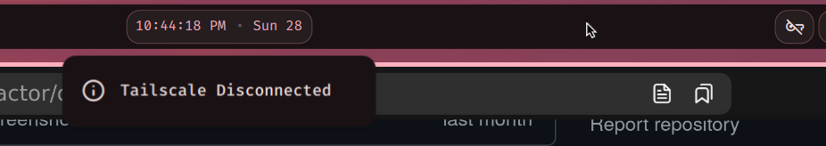

# DMS Tailscale

A simple DankMaterialShell (DMS) Bar widget for toggling your Tailscale connection. Requires the [Tailscale cli](https://tailscale.com/kb/1080/cli) to be installed, as well as any initial authentication to be configured. As Tailscale persists auth, after an initial successful authentication session, this plugin can run without requiring any sensitive information.

---



## Installation

```
mkdir -p ~/.config/DankMaterialShell/plugins/
git clone https://github.com/cglavin50/dms-tailscale
```

## Configuration

1. Install [Tailscale](https://tailscale.com/kb/1031/install-linux)
    - `curl -fsSL https://tailscale.com/install.sh | sh`
2. Run an initial authentication session (once only):
    - `tailscale up` and follow the provided url

That's it! After a successful auth, the plugin can handle the rest.

## Permissions

This plugin requires:

- `settings_read` - To read plugin configurations
- `settings_write` - To save plugin configurations

## Contributing

Feel free to fork, open issues, or PRs. If additional functionality is required I'm happy to add it :)
